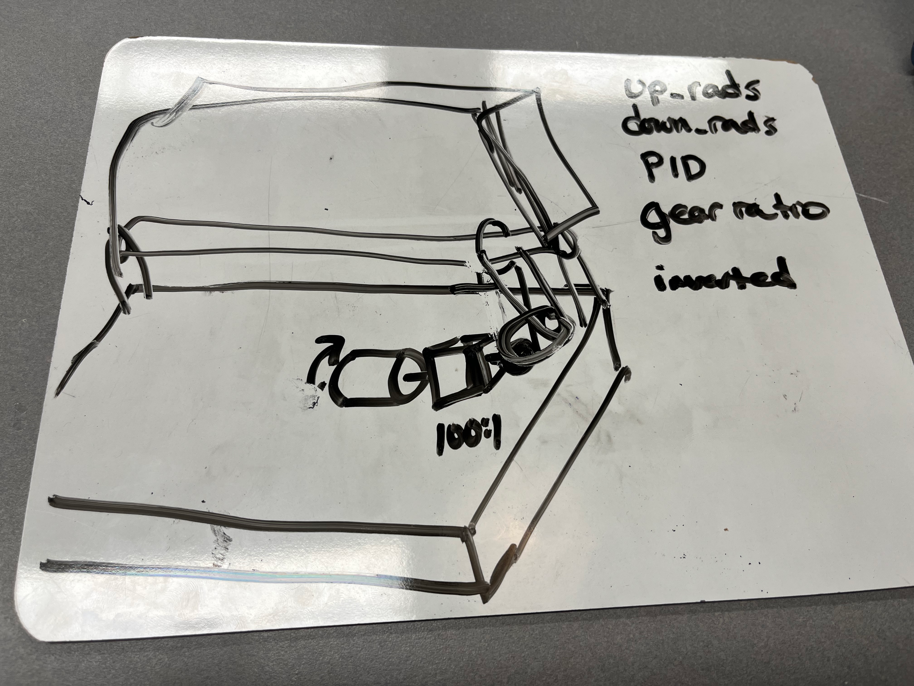

slapdown is a NEO550
schematic 

Copy code from 2026-Competition code hood module to start. We use that code because the hood uses a neo.

Functionally, the slapdown has an up and down position and toggles between them.

